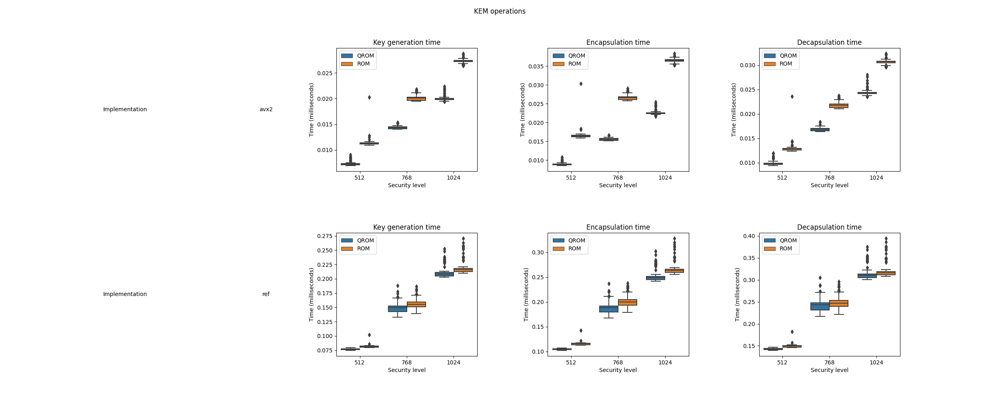
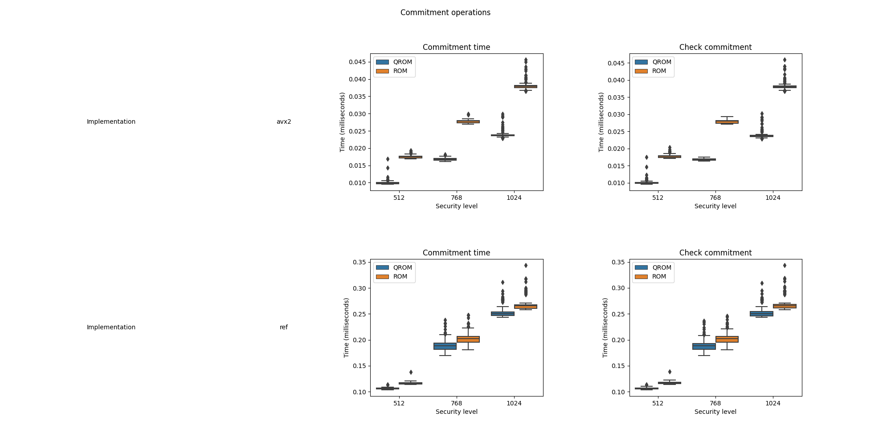
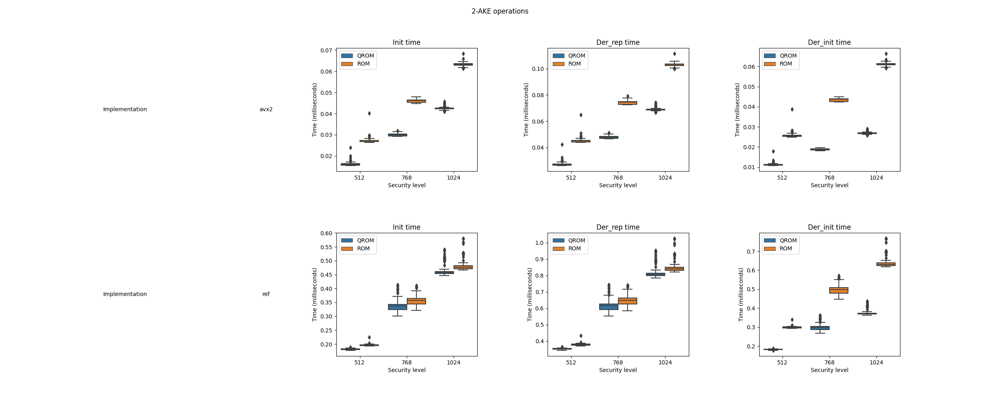
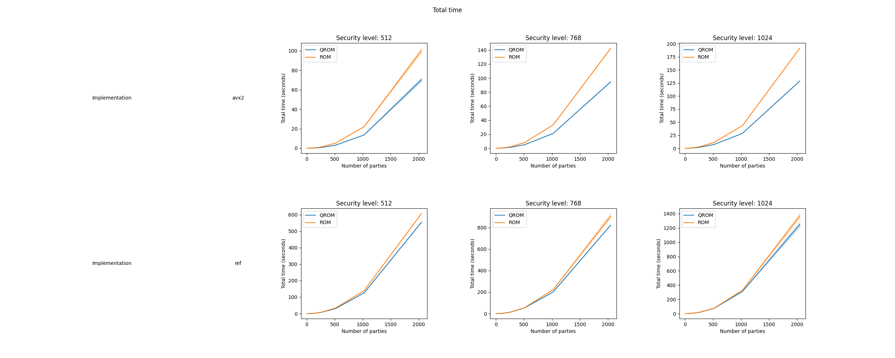
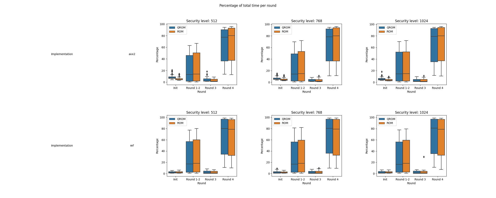

# Kyber-based Group Authenticated Group Key Exchange (GAKE)


This repository contains the implementation of ["Compiled Constructions towards Post-Quantum Group Key Exchange: A Design from Kyber"](https://www.mdpi.com/2227-7390/8/10/1853).

## What is Kyber?

[Kyber](https://www.pq-crystals.org/kyber/) is a key encapsulation mechanism (KEM) and a finalist in [round 3](https://csrc.nist.gov/Projects/post-quantum-cryptography/round-3-submissions) of the [NIST PQC](https://csrc.nist.gov/projects/post-quantum-cryptography) standardization project.

## Binaries

Download the latest version from [Releases](https://github.com/jiep/kyber-gake/releases).


## How to build

```bash
bash build.sh
```

### Prerequisites

* CMake
* OpenSSL

### How to build with Docker

1. Install [Docker](https://www.docker.com)

2. Build image

```bash
docker build -t kyber-gake .
```

3. Run container

```bash
docker run -it kyber-gake bash
```

## Test programs

Code contains two implementations of the GAKE: `ref` and `avx2`. Test programs are located in these folders. Each test program contains a `_qrom` version.

### Available test programs

```bash
.
|-- avx2
|   |-- test_gake1024_avx2
|   |-- test_gake512_avx2
|   |-- test_gake768_avx2
|   |-- test_gake_qrom1024_avx2
|   |-- test_gake_qrom512_avx2
|   |-- test_gake_qrom768_avx2
|   |-- test_gake_qrom_speed1024_avx2
|   |-- test_gake_qrom_speed512_avx2
|   |-- test_gake_qrom_speed768_avx2
|   |-- test_gake_speed1024_avx2
|   |-- test_gake_speed512_avx2
|   `-- test_gake_speed768_avx2
`-- ref
    |-- test_gake1024_ref
    |-- test_gake512_ref
    |-- test_gake768_ref
    |-- test_gake_qrom1024_ref
    |-- test_gake_qrom512_ref
    |-- test_gake_qrom768_ref
    |-- test_gake_qrom_speed1024_ref
    |-- test_gake_qrom_speed512_ref
    |-- test_gake_qrom_speed768_ref
    |-- test_gake_speed1024_ref
    |-- test_gake_speed512_ref
    `-- test_gake_speed768_ref
```

## Performance results

Latest performance results can be found on [Releases](https://github.com/jiep/kyber-gake/releases) under folder `results`.

### Atomic operations

#### KEM



#### Commitment



#### AKE



### GAKE performance

#### Time per number of parties



#### Time per round



## References

* Escribano Pablos, J.I.; González Vasco, M.I.; Marriaga, M.E.; Pérez del Pozo, Á.L. Compiled Constructions towards Post-Quantum Group Key Exchange: A Design from Kyber. Mathematics 2020, 8, 1853.
